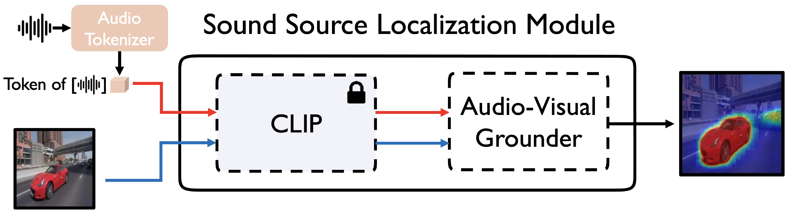

# Audio-Grounded Contrastive Learning (WACV’24)

Official pytorch implementation of out paper:

>  **[Can CLIP Help Sound Source Localization?](https://arxiv.org/abs/2311.04066)**  
>
> [Sooyoung Park*](https://sites.google.com/view/sooyoungpark), [Arda Senocak*](https://ardasnck.github.io/), [Joon Son Chung](https://mmai.io/joon/) (* Equal Contribution)
>
>  WACV 2024


## Introduction



This repo is pytorch implementation of Audio-Grounded Contrastive Learning (ACL). Code is very simple and easy to understand fastly.

Some of these codes are based on [AudioToken](https://github.com/guyyariv/AudioToken), [BEATs](https://github.com/microsoft/unilm/tree/master/beats), [TCL](https://github.com/kakaobrain/tcl).

Demo: [](https://huggingface.co/spaces/swimmiing/ACL-SSL-zeroshot-demo)

## Required packages

- Python = 3.10.8
- Pytorch = 1.13.0
- transformers = 4.25.1

### Installation

```bash
$ conda install -c nvidia cudatoolkit=11.7
$ conda install -c conda-forge cudnn
$ conda install python=3.10
$ pip install torch==1.13.0+cu117 torchvision==0.14.0+cu117 torchaudio==0.13.0 --extra-index-url https://download.pytorch.org/whl/cu117
$ pip install tensorboard
$ pip transformers==4.25.1
$ pip install opencv-python
$ pip install tqdm
$ pip install scikit-learn

```

## Data preparation

**Important Note:** All audio samples must be converted to 16kHz, and for detailed instructions, refer to the readme in each dataset-specific directory.

- **Dataset**
    - VGG-Sound: [[Link]](https://www.robots.ox.ac.uk/~vgg/data/vggsound/)
        - VGG-SS: [[Link]](https://www.robots.ox.ac.uk/~vgg/research/lvs/)
    - Flickr: [[Link]](https://github.com/ardasnck/learning_to_localize_sound_source)
    - AVSBench: [[Link]](http://www.avlbench.opennlplab.cn/dataset/avsbench)
    - Extended VGG-SS/Flickr: [[Link]](https://github.com/stoneMo/SLAVC)

## Model preparation

Downloading pretrained model (audio backbone) in pretrain folder
- BEATs: https://github.com/microsoft/unilm/tree/master/beats
  - BEATs_iter3_plus_AS2M_finedtuned_on_AS2M_cpt2.pt


## Training

- Ensure that you check the .sh files and set the `$ export CUDA_VISIBLE_DEVICES=”**”` according to your hardware setup.
- Make sure that `—model_name` corresponds to the configuration file located at `./config/model/{-model_name}.yaml`.
- Model files (.pth) will be saved in the directory `{—save_path}/Train_record/{-model_name}_{-exp_name}/`.
- Review the configuration settings in `./config/train/{-train_config}.yaml` to ensure they match your training requirements.
- Choose one of the following methods to initiate training:

```bash
$ sh SingleGPU_Experiment.sh. # For single GPU setup
$ sh Distributed_Experiment.sh. # For multi-GPU setup (DDP)
```

## Test

- Before testing, please review the .sh file and set the `$ export CUDA_VISIBLE_DEVICES=”**”` environment variable according to your hardware configuration.
- Ensure that the `—model_name` parameter corresponds to the configuration file located at `./config/model/{-model_name}.yaml`.
- Model files (.pth) located in the directory `{—save_path}/{-model_name}_{-exp_name}/Param_{-epochs}.pth` will be used for testing.
- The `—epochs` parameter can accept either an integer or a list of integers (e.g., 1, 2, 3).
- If `—epochs` is left unspecified (null), the default model file `{—save_path}/Train_record/{-model_name}_{-exp_name}/Param_best.pth` will be used for testing.

```bash
$ sh Test_PTModels
```

## P**retrained models**

**Important Note:** After downloading the Param_best.pth file, move it to the directory `{—save_path}/{-model_name}_{-exp_name}/` before use.

- VGG-Sound 144k trained model: [[Link]](https://drive.google.com/file/d/1XnVrBES3IKjAcV0uCkvbIdEEclcOYJoR/view?usp=drive_link)
  - This model was trained using a 2-GPU setup.

## **Citation**

If you use this project, please cite this project as:

```latex
@inproceedings{park2023clip,
      title={Can CLIP Help Sound Source Localization?}, 
      author={Sooyoung Park and Arda Senocak and Joon Son Chung},
      journal = {arXiv preprint arXiv:2311.04066},
      year={2023},
}
```